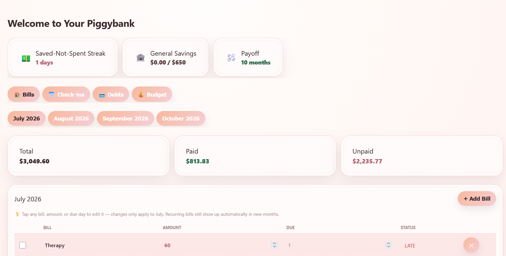
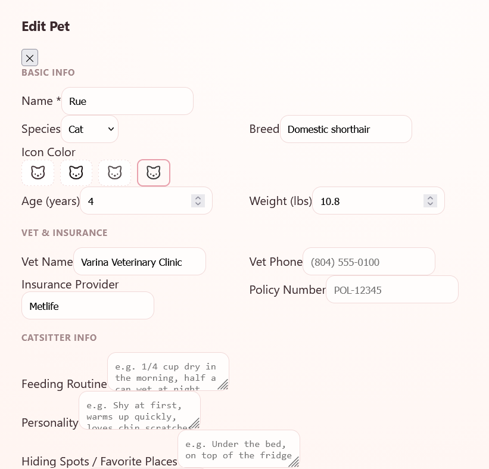

# Polly

A full-stack household management application for organizing home, finances, meals, pets, plants, and daily routines in one place. Housekeepers Club combines multiple household tools into a single responsive web app with cloud sync through Supabase.

**Live demo:** [polly-demo.vercel.app](https://polly-demo.vercel.app)

## Features

- 📊 Dashboard with household statistics and quick actions
- 💰 Personal finance and budgeting tools
- 🛒 Grocery list and shopping management
- 🍽️ Pantry inventory and meal planning
- 📖 Recipe collection and cooking tools
- 🌱 Plant care tracking
- 🐾 Pet care management
- 📅 Daily habit and wellness trackers
- ☁️ Cloud-synced data persistence via Supabase
- 📱 Responsive design for desktop and mobile

## Built With

- React
- TypeScript
- Vite
- Supabase (PostgreSQL)
- Recharts
- Lucide React
- Vercel

## Screenshots

### Dashboard


### Wallet


### Grocery & Meal Planner


### Plant Tracker


### Pet Tracker


### Personal Tracker


## Getting Started

Clone the repository:

```bash
git clone https://github.com/SephoriaBot/polly.git
cd polly/craft-app
```

Install dependencies:

```bash
npm install
```

Configure environment variables — create a `.env` file in `craft-app/`:

```
VITE_SUPABASE_URL=your_project_url
VITE_SUPABASE_ANON_KEY=your_anon_key
```

Start the development server:

```bash
npm run dev
```

## Tech Highlights

- Full CRUD functionality against a Supabase/PostgreSQL backend
- Modular React component architecture
- TypeScript for type safety
- Interactive dashboards and data visualization with Recharts
- Real-time data persistence
- Deployed with Vercel

## Future Improvements

- Shared household accounts
- Push notifications and reminders
- Offline support
- Calendar integration
- Expanded analytics and reporting
- Export and backup functionality

## License

This project is licensed under the MIT License.
